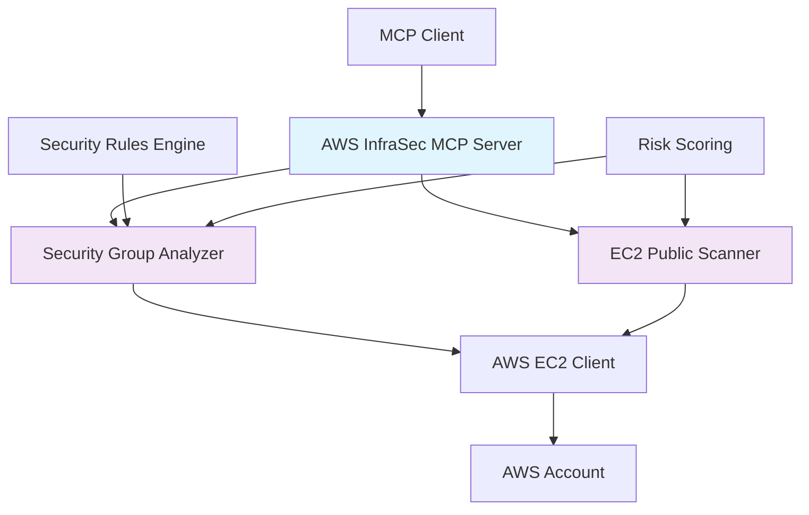

# Simplified AWS Infrastructure Security MCP Server - Implementation Plan

## Project Overview
**Goal**: Create a learning-focused portfolio piece demonstrating MCP server development and AWS security knowledge  
**Timeline**: 3-4 hours total implementation  
**Focus**: Security Group Analyzer (primary) + EC2 Public Instance Scanner (secondary)

## Architecture Overview



## Project Structure

```
aws-infrasec-mcp-server/
├── src/
│   ├── index.ts                    # Main MCP server entry point
│   ├── tools/
│   │   ├── security-groups.ts      # Primary security group analyzer
│   │   └── public-instances.ts     # Secondary EC2 scanner
│   ├── services/
│   │   ├── aws-client.ts           # AWS SDK setup and configuration
│   │   └── analyzer.ts             # Shared analysis logic and utilities
│   └── rules/
│       └── security-rules.json     # JSON-based security rule definitions
├── package.json                    # Dependencies and scripts
├── tsconfig.json                   # TypeScript configuration
├── README.md                       # Portfolio documentation
├── .env.example                    # Environment variables template
└── examples/
    ├── usage-examples.md           # Demo scenarios and outputs
    └── mcp-settings.json           # MCP client configuration example
```

## Setup Instructions

### Prerequisites
- Node.js 18+ installed
- AWS CLI configured or AWS credentials available
- TypeScript knowledge
- Basic understanding of AWS EC2 and Security Groups

### Environment Setup

1. **Initialize Project**
```bash
mkdir aws-infrasec-mcp-server
cd aws-infrasec-mcp-server
npm init -y
```

2. **Install Dependencies**
```bash
npm install @modelcontextprotocol/sdk @aws-sdk/client-ec2 zod
npm install -D typescript @types/node ts-node
```

3. **Configure TypeScript**
```json
{
  "compilerOptions": {
    "target": "ES2020",
    "module": "commonjs",
    "lib": ["ES2020"],
    "outDir": "./build",
    "rootDir": "./src",
    "strict": true,
    "esModuleInterop": true,
    "skipLibCheck": true,
    "forceConsistentCasingInFileNames": true,
    "declaration": true,
    "declarationMap": true,
    "sourceMap": true
  },
  "include": ["src/**/*"],
  "exclude": ["node_modules", "build"]
}
```

4. **Environment Variables**
```bash
# .env.example
AWS_REGION=us-east-1
AWS_ACCESS_KEY_ID=your_access_key_here
AWS_SECRET_ACCESS_KEY=your_secret_key_here
# Optional: AWS_PROFILE=your_profile_name
```

## AWS Configuration

### Required AWS Permissions (Minimal IAM Policy)
```json
{
  "Version": "2012-10-17",
  "Statement": [
    {
      "Sid": "InfraSecMCPPermissions",
      "Effect": "Allow",
      "Action": [
        "ec2:DescribeSecurityGroups",
        "ec2:DescribeInstances",
        "ec2:DescribeNetworkInterfaces"
      ],
      "Resource": "*"
    }
  ]
}
```

### AWS Setup Options

**Option 1: AWS CLI Profile**
```bash
aws configure --profile infrasec-mcp
# Enter your credentials when prompted
export AWS_PROFILE=infrasec-mcp
```

**Option 2: Environment Variables**
```bash
export AWS_ACCESS_KEY_ID=your_key_id
export AWS_SECRET_ACCESS_KEY=your_secret_key
export AWS_REGION=us-east-1
```

**Option 3: IAM Roles (for EC2)**
- Attach the IAM policy to an EC2 instance role
- No credentials needed in code

## Core Tools Implementation

### 1. Security Group Analyzer (`analyze_security_groups`)

**Input Schema:**
```typescript
{
  region?: string;          // AWS region (defaults to configured region)
  groupIds?: string[];      // Specific security group IDs (optional)
  includeUnused?: boolean;  // Include unused security groups analysis
}
```

**Key Security Checks:**
- SSH (port 22) open to 0.0.0.0/0
- RDP (port 3389) open to 0.0.0.0/0  
- Database ports (3306, 5432, 1433) exposed publicly
- HTTP/HTTPS (80/443) unrestricted access patterns
- Unused security groups detection
- Overly permissive port ranges

**Output Format:**
```typescript
{
  summary: {
    totalGroups: number;
    highRiskFindings: number;
    mediumRiskFindings: number;
    lowRiskFindings: number;
  };
  findings: Array<{
    securityGroupId: string;
    securityGroupName: string;
    ruleId: string;
    severity: 'HIGH' | 'MEDIUM' | 'LOW';
    description: string;
    recommendation: string;
    affectedRule: {
      port: number | string;
      protocol: string;
      source: string;
    };
  }>;
}
```

### 2. EC2 Public Instance Scanner (`scan_public_instances`)

**Input Schema:**
```typescript
{
  region?: string;          // AWS region
  includeSecurityGroups?: boolean;  // Include security group analysis
}
```

**Key Checks:**
- Instances with public IP addresses
- Security group associations for public instances
- Port exposure correlation with public access
- Instance state and accessibility

**Output Format:**
```typescript
{
  summary: {
    totalInstances: number;
    publicInstances: number;
    exposedPorts: number;
  };
  publicInstances: Array<{
    instanceId: string;
    publicIp: string;
    securityGroups: string[];
    exposedPorts: number[];
    riskLevel: 'HIGH' | 'MEDIUM' | 'LOW';
    recommendations: string[];
  }>;
}
```

## Security Rules Configuration

### security-rules.json Structure
```json
{
  "rules": [
    {
      "id": "sg-ssh-world",
      "name": "SSH Open to World",
      "description": "SSH port 22 is accessible from anywhere (0.0.0.0/0)",
      "severity": "HIGH",
      "port": 22,
      "protocol": "tcp",
      "source": "0.0.0.0/0",
      "recommendation": "Restrict SSH access to specific IP ranges or use VPN/bastion host"
    },
    {
      "id": "sg-rdp-world", 
      "name": "RDP Open to World",
      "description": "RDP port 3389 is accessible from anywhere (0.0.0.0/0)",
      "severity": "HIGH",
      "port": 3389,
      "protocol": "tcp", 
      "source": "0.0.0.0/0",
      "recommendation": "Restrict RDP access to specific IP ranges or use VPN"
    },
    {
      "id": "sg-db-exposed",
      "name": "Database Ports Exposed",
      "description": "Database ports are accessible from the internet",
      "severity": "HIGH",
      "ports": [3306, 5432, 1433, 5984],
      "protocol": "tcp",
      "source": "0.0.0.0/0",
      "recommendation": "Place databases in private subnets and restrict access through application servers"
    },
    {
      "id": "sg-unused",
      "name": "Unused Security Group",
      "description": "Security group is not attached to any resources",
      "severity": "LOW",
      "recommendation": "Remove unused security groups to reduce attack surface and management overhead"
    }
  ]
}
```

## Implementation Timeline (3-4 Hours)

### Phase 1: Foundation Setup (45 minutes)
- [ ] Initialize TypeScript project with proper configuration
- [ ] Set up MCP SDK integration and server structure
- [ ] Configure AWS SDK client with credential handling
- [ ] Create basic project structure and files
- [ ] Test AWS connectivity and permissions

### Phase 2: Security Group Analyzer (90 minutes)
- [ ] Implement [`analyze_security_groups`](src/tools/security-groups.ts) tool
- [ ] Create security rules engine with JSON configuration
- [ ] Add rule evaluation logic for high-priority checks
- [ ] Implement risk scoring and finding categorization
- [ ] Test with sample security groups and validate output

### Phase 3: EC2 Public Scanner (45 minutes)
- [ ] Implement [`scan_public_instances`](src/tools/public-instances.ts) tool
- [ ] Add public IP detection and security group correlation
- [ ] Create exposure assessment logic
- [ ] Integrate with existing risk scoring system
- [ ] Test with sample EC2 instances

### Phase 4: Documentation & Polish (30 minutes)
- [ ] Create comprehensive README with setup instructions
- [ ] Add usage examples and sample outputs
- [ ] Document MCP client configuration
- [ ] Add error handling and input validation
- [ ] Prepare GitHub repository for portfolio presentation

## MCP Client Configuration

### Claude Desktop Configuration
```json
{
  "mcpServers": {
    "aws-infrasec": {
      "command": "node",
      "args": ["/path/to/aws-infrasec-mcp-server/build/index.js"],
      "env": {
        "AWS_REGION": "us-east-1",
        "AWS_ACCESS_KEY_ID": "your_access_key",
        "AWS_SECRET_ACCESS_KEY": "your_secret_key"
      }
    }
  }
}
```

### Alternative: Using AWS Profile
```json
{
  "mcpServers": {
    "aws-infrasec": {
      "command": "node", 
      "args": ["/path/to/aws-infrasec-mcp-server/build/index.js"],
      "env": {
        "AWS_PROFILE": "infrasec-mcp",
        "AWS_REGION": "us-east-1"
      }
    }
  }
}
```

## Testing Strategy

### Manual Testing Scenarios
1. **Basic Security Group Analysis**
   - Create test security group with SSH open to world
   - Run analyzer and verify HIGH severity finding
   - Test with multiple security groups

2. **Public Instance Detection**
   - Launch EC2 instance with public IP
   - Attach security group with exposed ports
   - Run scanner and verify detection

3. **Error Handling**
   - Test with invalid AWS credentials
   - Test with non-existent regions
   - Test with insufficient permissions

### Sample Test Commands
```bash
# Build the project
npm run build

# Test AWS connectivity
node -e "
const { EC2Client, DescribeSecurityGroupsCommand } = require('@aws-sdk/client-ec2');
const client = new EC2Client({ region: 'us-east-1' });
client.send(new DescribeSecurityGroupsCommand({})).then(() => console.log('AWS connection successful')).catch(console.error);
"

# Run MCP server locally
node build/index.js
```

## Portfolio Value Proposition

### Technical Skills Demonstrated
- **MCP Server Development**: Shows ability to create custom tools for AI workflows
- **AWS SDK Integration**: Demonstrates cloud service integration expertise
- **TypeScript Proficiency**: Clean, type-safe code with proper error handling
- **Security Analysis**: Understanding of infrastructure security principles
- **JSON-based Configuration**: Extensible rule engine design

### Security Knowledge Showcased
- **Network Security**: Understanding of security groups, ports, and protocols
- **AWS Best Practices**: Knowledge of common misconfigurations and remediation
- **Risk Assessment**: Ability to prioritize security findings by severity
- **Practical Remediation**: Actionable recommendations for security improvements

### Career Transition Value
- **Operations to Security**: Applies infrastructure knowledge to security analysis
- **Automation Focus**: Demonstrates ability to automate security assessments
- **Educational Approach**: Well-documented code suitable for learning and extension
- **Portfolio Ready**: GitHub repository showcasing progression and technical growth

## Next Steps After Implementation

1. **Enhanced Features** (Optional Future Work):
   - Add VPC flow log analysis
   - Implement compliance framework mapping (CIS, NIST)
   - Add cost optimization recommendations
   - Create web dashboard for findings visualization

2. **Integration Opportunities**:
   - Connect with AWS Config for compliance tracking
   - Integrate with AWS Security Hub for centralized findings
   - Add Slack/email notifications for critical findings

3. **Learning Extensions**:
   - Study AWS Well-Architected Security Pillar
   - Explore infrastructure as code security scanning
   - Research cloud security posture management (CSPM) tools

## Success Metrics

- [ ] MCP server successfully connects to AWS and retrieves resource data
- [ ] Security Group Analyzer identifies common misconfigurations accurately
- [ ] EC2 Public Scanner correlates instance exposure with security group rules
- [ ] Documentation enables easy setup and understanding by potential employers
- [ ] Code demonstrates clean architecture and professional development practices
- [ ] Repository showcases learning progression in cloud security domain